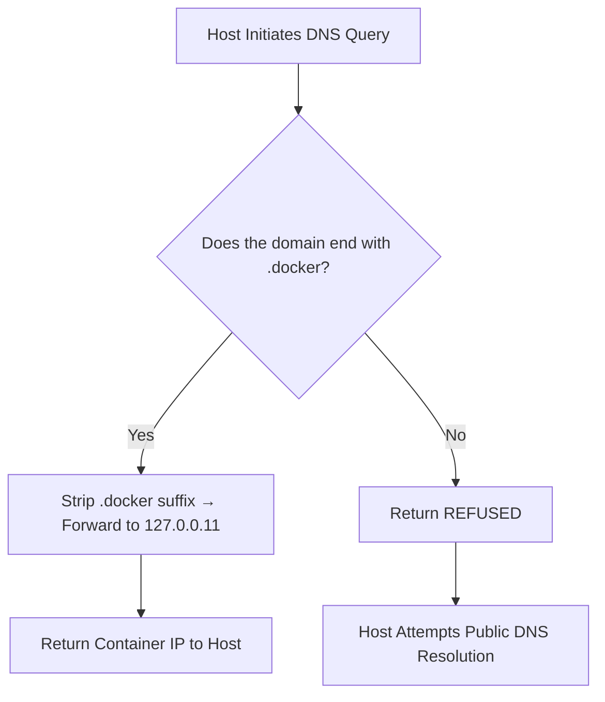

# Docker DNS Forwarder

**Resolve Container Names to IPs from Host Machine**

In a Docker environment, containers can usually access each other directly by their container names (relying on Docker's built-in DNS service 127.0.0.11). However, the host machine cannot resolve container names by default, which brings inconvenience to accessing containers from the host.

Traditional solutions all have obvious drawbacks:

- Port Mapping: Requires manual binding of container ports to the host, which is prone to port clutter and difficulty in memorization;

- Fixed Container IP: Lacks flexibility in IP management; reconfiguration is needed when scaling or adjusting containers;

- Monitoring Docker sock File and Maintaining hosts: Requires root privileges, posing potential security risks, and the configuration and maintenance are cumbersome;

- Deploying Local DNS Service: Redundant in functions and bloated in size; deploying it merely for resolving container names is an overkill.

**Docker DNS Forwarder is specifically designed to address the above pain points:**

It is a lightweight DNS forwarder running in a Docker container based on the scratch image, with an image size of only 1.5MB. Its core logic is "precise forwarding, refusal for non-matching requests" — it does not provide an independent DNS service, but only forwards domain name resolution requests matching the pattern "container name + custom suffix" to Docker's built-in DNS (127.0.0.11). All other domain name requests are rejected (return REFUSED), and the host machine will automatically switch to public DNS for resolution, which does not affect normal internet access at all.

**Extremely Simple Usage**

Only two steps are required to enable the host to resolve container names:

1. Map port 53 of the forwarder container to the host machine;

2. Set the preferred DNS address of the host machine to127.0.0.1.

After that, you can directly access containers from the host using the domain name format container-name.custom-suffix, without the need for tedious operations such as port mapping, fixing container IPs, or modifying the hosts file.

## Read this in other languages

[English](README.md)

[中文,Chinese](README_zh.md)

## ✨ Feature Highlights  

### 1. Host Machine Resolves Container Names Directly  

By intercepting domain names that end with a custom suffix (e.g., `.docker`) and forwarding them to Docker’s built-in DNS server, the host can access containers seamlessly.  

Example:  

```bash
curl http://myapp.docker:8080
```  

*The default suffix can be modified via command-line arguments or environment variables.*  

### 2. Lightweight Forwarding Logic  

- Domains matching `.docker` → Forwarded to Docker’s built-in DNS (`127.0.0.11`) for container IP resolution.  
- All other domains → Return `REFUSED`, so the host automatically uses public DNS (no impact on normal internet access).  

*The default forwarding address can be modified via command-line arguments or environment variables.*  

### 3. Gateway Access Support  

A default domain `gateway.docker` is provided, which automatically resolves to the host machine’s IP.  

*The default gateway name can be modified via command-line arguments or environment variables.*  

### 4. Low Resource Footprint  

Built on the `ldns` library and UDP protocol, it runs with minimal CPU and memory usage.  

### 5. Usage Inside Containers  

Docker’s built-in DNS forwards non-container-name domains to the host’s DNS service. This means you can also use domains like `gateway.docker` **inside Docker containers**:  
Docker forwards the request to the host’s configured DNS server (i.e., this forwarder). The forwarder strips the `.docker` suffix to form a valid container name, then uses Docker’s built-in DNS to resolve the IP and return the result.  

## ⚠️ Important Notes  

- Docker’s **default bridge network (docker0)** does not support inter-container access via container names (only via IP).  

  Use a **custom network** (created with `docker network create`) to enable normal container name resolution.  
  For details on Docker custom networks, refer to the [official Docker documentation](https://docs.docker.com/network/bridge/).  

- Domain name queries are **case-insensitive**.  

## 🛠️ Working Principle  



## 🚀 Deployment Methods  

| Solution | Base Image          | Core Features                                      | Image Size                          | Build Script      |
|----------|---------------------|----------------------------------------------------|-------------------------------------|-------------------|
| `static` | `scratch` (empty)   | Contains only static binaries (no redundant system components) | Binary < 1.5MB                      | `build-static.sh` |
| `alpine` | `alpine:3.22`       | Lightweight Linux distro + runtime libraries + binaries | Binary ≈ 40kB + Image ≈ 9MB         | `build-alpine.sh` |

### Method 1: Script Automation  

1. Download or clone the repository.  
2. Run the build script: `build-alpine.sh` or `build-static.sh`.  
3. Run the startup script `docker-run.sh` and follow the prompts to complete initialization and deployment.  

### Method 2: Manual Deployment  

1. Build the image and run the container:  

   ```bash
   # Clone the source code
   git clone https://github.com/bytesharky/docker-dns
   # Domestic mirror (China):
   # git clone https://gitee.com/bytesharky/docker-dns

   cd docker-dns
   docker build -t docker-dns:static .

   # Start the container
   # Mount timezone data (optional: for local time in logs)
   # Set log level (optional: default is INFO)
   docker run -d \
     -e LOG_LEVEL=INFO \
     -e TZ=/zoneinfo/Asia/Shanghai \
     -v /usr/share/zoneinfo:/zoneinfo:ro \
     --network docker-net \
     --name docker-dns-a \
     -p 53:53/udp \
     --restart always \
     docker-dns:static
   ```  

2. Configure Host DNS  
   Edit `/etc/resolv.conf` and set `127.0.0.1` as the top DNS server:  

   ```conf
   nameserver 127.0.0.1       # Local forwarder
   nameserver 223.5.5.5       # Public DNS 1
   nameserver 8.8.8.8         # Public DNS 2
   ```  

   (Optional) Prevent the file from being overwritten by the system:  

   ```bash
   sudo chattr +i /etc/resolv.conf
   ```  

### Method 3: Use a Prebuilt Image  

1. Pull the prebuilt image:  

   ```bash
   docker pull ccr.ccs.tencentyun.com/sharky/docker-dns:static

   docker tag ccr.ccs.tencentyun.com/sharky/docker-dns:static docker-dns:static
   
   # Start the container
   # Mount timezone data (optional: for local time in logs)
   # Set log level (optional: default is INFO)
   docker run -d \
     -e LOG_LEVEL=INFO \
     -e TZ=/zoneinfo/Asia/Shanghai \
     -v /usr/share/zoneinfo:/zoneinfo:ro \
     --network docker-net \
     --name docker-dns \
     -p 53:53/udp \
     --restart always \
     docker-dns:static
   ```  

2. Configure Host DNS  
   Refer to Step 2 in **Method 2**.  

## ✅ Function Verification  

### 1. Verify Container Name Resolution  

```bash
ping -c 3 docker-dns.docker
```  

Expected output (IP = container’s internal network address):  

```bash
PING docker-dns.docker (172.18.0.6): 56 data bytes
64 bytes from 172.18.0.6: icmp_seq=1 ttl=64 time=0.05 ms
```  

### 2. Verify Public Domain Resolution  

```bash
ping -c 3 github.com
```  

Expected output (public IP):  

```bash
PING github.com (140.82.112.4): 56 data bytes
64 bytes from 140.82.112.4: icmp_seq=1 ttl=51 time=10.2 ms
```  

## Troubleshooting  

Control the program’s output by setting the `LOG_LEVEL` environment variable (default: `INFO`).  

Supported levels: `DEBUG`, `INFO`, `WARN`, `ERROR`, `FATAL`  

### Log Level (DEBUG/INFO/WARN/ERROR/FATAL) Explanation  

| Number   |Log Level | Core Meaning                                                                 | Severity Level                |
|---|--------|-----------------------------------------------------------------------------|-------------------------------|
| 0 | DEBUG  | Debug level: Prints detailed runtime info for development/testing (aids in code debugging) | Lowest (only for dev environments) |
| 1 | INFO   | Info level: Records key statuses of normal system operation                 | Low (safe for production; logs normal events) |
| 2 | WARN   | Warning level: Records non-fatal exceptions or potential risks (system continues running) | Medium (monitor; may predict future issues) |
| 3 | ERROR  | Error level: Records fatal exceptions (single DNS resolution fails, but system remains functional) | High (investigate promptly to avoid scope expansion) |
| 4 | FATAL  | Fatal level: Records critical errors that render the system completely inoperable | Highest (system unavailable; urgent fix required) |

## 📌 Summary  

The Docker DNS Forwarder acts as a "bridge" between the host machine and Docker’s built-in DNS. Its key advantages:  

- 🟢 Host resolves `.docker` domains seamlessly  
- 🟢 No impact on normal internet DNS resolution  
- 🟢 Simple deployment + minimal resource usage  

### Ideal Use Cases  

**Development/testing environments**, or scenarios where the host needs direct access to containers via container names.  

Use **with caution in production environments** — fixed IP addresses are recommended instead.  

## Appendix: Command-Line Arguments / Environment Variables  

| Short Opt | Long Option       | Env Variable      | Description                                                                 | Default Value     |
|-----------|-------------------|-------------------|-----------------------------------------------------------------------------|-------------------|
| `-L`      | `--log-level`     | `LOG_LEVEL`       | Sets log verbosity (controls detail of output)                             | `INFO`            |
| `-G`      | `--gateway`       | `GATEWAY_NAME`    | Sets gateway name (inside Docker, the gateway is the host; allows resolving the host IP via `gateway-name.suffix`) | `gateway`         |
| `-S`      | `--suffix`        | `SUFFIX_DOMAIN`   | Sets the domain suffix for forwarded DNS queries                           | `.docker`         |
| `-C`      | `--container`     | `CONTAINER_NAME`  | Sets container name (used to send a test `container-name.suffix` resolution request to the forwarder on startup) | `docker-dns`      |
| `-D`      | `--dns-server`    | `FORWARD_DNS`     | Sets the target DNS server for forwarded queries (default: Docker’s built-in DNS) | `127.0.0.11`      |
| `-P`      | `--port`          | `LISTEN_PORT`     | Sets the port the service listens on                                        | `53`              |
| `-K`      | `--keep-suffix`   | `KEEP_SUFFIX`     | Controls whether to retain the suffix when forwarding DNS queries (strip suffix when forwarding to `127.0.0.11`) | Disabled          |
| `-M`      | `--max-hops`      | `MAX_HOPS`        | Sets maximum hop count for DNS queries (prevents looped queries)           | `3`               |
| `-W`      | `--workers`       | `NUM_WORKERS`     | Sets the number of worker threads for the service                           | `4`               |
| `-f`      | `--foreground`    | -                 | Runs the service in foreground mode (does not daemonize)                   | Disabled (daemon by default) |
| `-h`      | `--help`          | -                 | Shows this help message (lists options + descriptions) and exits            | -                 |

```bash
root@VM-4-2-debian:~# ./docker-dns/docker-dns -h
Usage: ./docker-dns [OPTIONS]
Options:
  -L, --log-level    Set log level (DEBUG, default: INFO, WARN, ERROR, FATAL)
  -G, --gateway      Set gateway name (default: gateway)
  -S, --suffix       Set suffix name (default: .docker)
  -C, --container    Set container name (default: docker-dns)
  -D, --dns-server   Set forward DNS server (default: 127.0.0.11)
  -P, --port         Set listening port (default: 53)
  -K, --keep-suffix  keep suffix forward dns query (default: strip)
  -M, --max-hops     Set maximum hop count (default: 3)
  -W, --workers      Set number of worker threads (default: 4)
  -f, --foreground   Run in foreground mode (do not daemonize)
  -h, --help         Show this help message and exit

Environment variable:
  Command-line arguments take precedence over environment variables.
  --log-level    =>  LOG_LEVEL
  --gateway      =>  GATEWAY_NAME
  --suffix       =>  SUFFIX_DOMAIN
  --container    =>  CONTAINER_NAME
  --dns-server   =>  FORWARD_DNS
  --port         =>  LISTEN_PORT
  --keep-suffix  =>  KEEP_SUFFIX
  --max-hops     =>  MAX_HOPS
  --workers      =>  NUM_WORKERS
```
