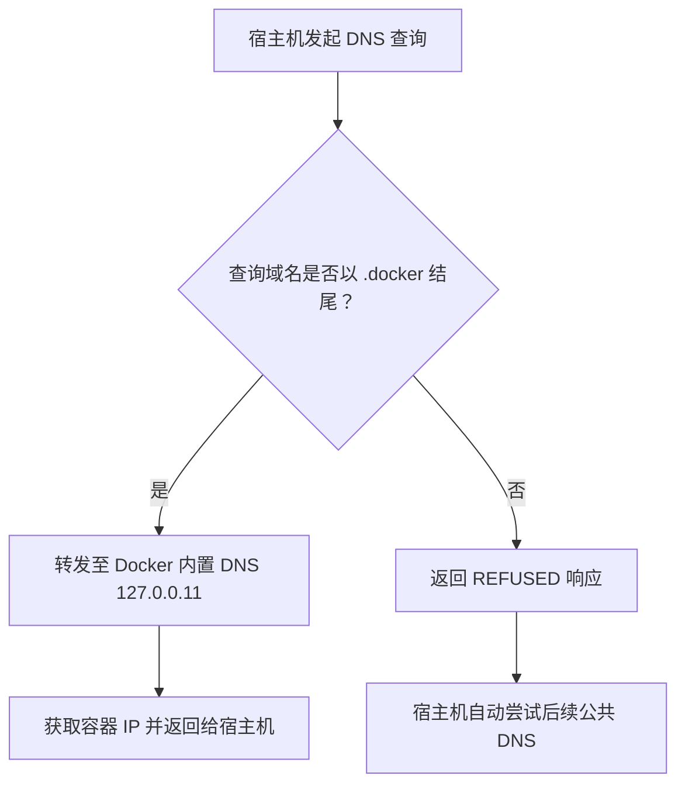

# Docker 专用 DNS 转发器：让宿主机解析 .docker 域名

该 Docker DNS 转发器目的是实现在宿主机使用容器名访问容器的服务，无需映射端口，无需修改hosts文件。

在 Docker 环境中，默认情况下容器间可通过容器名通信（依赖 Docker 内置 DNS 服务器 `127.0.0.11`），但宿主机无法直接解析容器名。

于是我编写了这个小工具 **Docker DNS 转发器**，用于解决这一问题——让宿主机可以通过 `容器名.docker` 域名访问容器，同时不影响其他公共域名解析。

**注意：**
Docker 的默认 bridge 网络（即 docker0 网桥）是一个特殊的网络，它不支持容器间通过容器名直接通信，仅支持通过 IP 地址访问。这与用户自定义的 bridge 网络（docker network create 创建）不同，故而该转发器要配合自定义网络使用，有关自定义网络可参考Docker官方说明。

## 一、核心功能

该 DNS 转发器运行在宿主机 `127.0.0.1:53`（标准 DNS 端口），核心逻辑分为两步：

1. **拦截 `.docker` 域名**：若查询域名以 `.docker` 结尾（如 `docker-dns.docker`），去除 `.docker` 后缀后转发至 Docker 内置 DNS（`127.0.0.11`），获取容器真实 IP；
2. **拒绝非 `.docker` 域名**：对其他域名（如 `github.com`、`baidu.com`）返回 `REFUSED` 响应，引导宿主机自动使用后续公共 DNS 解析，不影响正常上网。

**注意：** 对于 `.docker` 后缀，大小写不敏感。

## 二、适用场景

- **宿主机需通过容器名访问容器**：无需手动配置 `/etc/hosts` 或端口映射，直接用 `容器名.docker` 访问（如 `ping docker-dns.docker`）；
- **轻量化需求**：无需部署复杂 DNS 服务（如 Bind），仅通过轻量级 C 程序实现核心功能。

## 三、实现原理

### 1. 技术依赖

- **ldns 库**：开源 DNS 处理库，用于解析/构建 DNS 报文、与 Docker 内置 DNS 通信；
- **UDP 协议**：DNS 协议默认使用 UDP（端口 53），确保解析效率；
- **Linux 网络配置**：通过 `/etc/resolv.conf` 将宿主机 DNS 优先指向 `127.0.0.1`（转发器地址）。

### 2. 核心流程



## 四、部署步骤

### 1. 自动构建/部署

下载此仓库的 `docker_dns.sh` 脚本，执行该脚本根据引导完成部署。

### 2. 手动构建/部署

#### 1. 构建Docker-DNS

```bash

# 克隆此仓库
git clone https://github.com/bytesharky/docker-dns
# 国内网络可用
# git clone https://gitee.com/bytesharky/docker-dns

# 进入目录并构建镜像
cd docker-dns
docker build -t docker-dns:alpine .

# 启动容器
docker run -d \
    --network docker-net \
    --name docker-dns \
    -p 53:53/udp \
    --restart unless-stopped \
    docker-dns:alpine

```

#### 2. 配置宿主机 DNS 优先级

1. 编辑 `/etc/resolv.conf`，将 `127.0.0.1` 设为第一优先 DNS：

   ```bash
   sudo nano /etc/resolv.conf
   ```

   写入以下内容（保留原有公共 DNS 作为备用）：

   ```conf
   nameserver 127.0.0.1          # 优先使用本地转发器
   nameserver 183.60.83.19       # 备用公共 DNS 1
   nameserver 183.60.82.98       # 备用公共 DNS 2
   ```

2. （可选）锁定文件防篡改：
   避免其他程序修改 `/etc/resolv.conf`，执行：

   ```bash
   sudo chattr +i /etc/resolv.conf
   ```

   后续需修改时，先解锁：`sudo chattr -i /etc/resolv.conf`。

## 五、验证功能

### 1. 验证 .docker 域名解析

假设存在名为 `docker-dns` 的容器，执行：

```bash
# ping .docker 域名（应解析到容器 IP）
ping -c 3 docker-dns.docker
```

成功输出示例（IP 为容器内网 IP，如 `172.18.0.6`）：

```bash
PING docker-dns.docker (172.18.0.6) 56(84) bytes of data.
64 bytes from 172.18.0.6 (172.18.0.6): icmp_seq=1 ttl=64 time=0.05ms
```

### 2. 验证公共域名解析

执行以下命令，确认非 `.docker` 域名可正常解析：

```bash
# ping 公共域名（应通过备用 DNS 解析）
ping -c 3 github.com
```

成功输出示例（IP 为 GitHub 公共 IP）：

```bash
PING github.com (140.82.112.4) 56(84) bytes of data.
64 bytes from 140.82.112.4 (140.82.112.4): icmp_seq=1 ttl=51 time=10.2ms
```

## 六、总结

该 DNS 转发器是宿主机与 Docker 内置 DNS 之间的“轻量级桥梁”，通过简单的转发逻辑实现了：

- ✅ 宿主机无缝解析 `.docker` 域名；
- ✅ 不影响公共域名正常解析；
- ✅ 部署简单，资源占用低（仅占用少量内存和 CPU）。

适用于需要在宿主机直接访问容器的开发、测试场景，或对 Docker 网络隔离有需求的环境。
