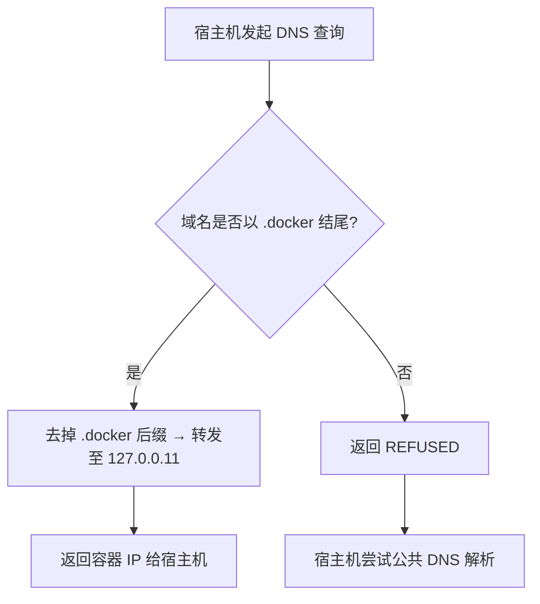

# Docker DNS 转发器

**让宿主机轻松解析容器名到 IP 地址**

在 Docker 环境中，容器间虽可通过容器名直接访问（依托 Docker 内置 DNS 服务 `127.0.0.11`），但**宿主机默认无法直接解析容器名**，这给宿主机访问容器带来了诸多不便。

传统解决方案均存在明显弊端：

- 端口映射：需手动绑定容器端口到宿主机，易造成端口混乱、难以记忆；

- 固定容器 IP：IP 管理缺乏灵活性，扩容或调整容器时需重新配置；

- 监听 Docker sock 文件并维护 hosts：需 root 权限，存在权限安全风险，且配置维护繁琐；

- 部署本地 DNS 服务：功能冗余、体积臃肿，仅为解析容器名而部署显得「大材小用」。

**Docker DNS 转发器 专为解决上述痛点而生：**

它是一款运行在基于 scratch 镜像的 Docker 容器中的轻量级 DNS 转发器，镜像体积仅 1.5MB，核心逻辑是「精准转发、非匹配拒绝」—— 不提供独立 DNS 服务，仅将匹配「容器名+自定义后缀」的域名解析请求转发至 Docker 内置 DNS（`127.0.0.11`），其余域名请求一律返回 REFUSED，此时宿主机会自动切换至公共 DNS 解析，完全不影响正常上网。

**极简使用方式**

只需两步即可实现宿主机解析容器名：

1. 将该转发器容器的 53 端口映射到宿主机；

2. 将宿主机的首选 DNS 地址设置为 `127.0.0.1`。

此后，你即可在宿主机通过 `容器名.自定义后缀` 的域名形式直接访问容器，无需再做端口映射、固定容器 IP、修改 hosts 文件等繁琐操作。

## Read this in other languages

[English](README.md)

[中文,Chinese](README_zh.md)

## ✨ 功能特性

### 1. 宿主机直接解析容器名

通过拦截容器名 + 自定义后缀（例如 `.docker`）的域名，并转发给 Docker 的内置 DNS 服务器，实现在宿主机上访问容器。

例如：

```bash
curl http://myapp.docker:8080
```  

*可通过命令行参数或环境变量修改默认的后缀名称*  

### 2. 轻量级转发逻辑

- 匹配 `.docker` 域名 → 转发到 Docker 内置 DNS（`127.0.0.11`）解析容器 IP；
- 其他域名 → 返回 `REFUSED`，宿主机自动使用公共 DNS，不影响正常上网。

*可通过命令行参数或环境变量修改默认的转发地址*  

### 3. 网关访问支持

默认提供 `gateway.docker` 域名，可自动解析为宿主机 IP。

*可通过命令行参数或环境变量修改默认的网关名称*  

### 4. 低资源占用

  基于 `ldns` 库 + UDP 协议，仅用极少 CPU 和内存即可运行。

### 5. 容器内使用

  Docker内置的DNS服务器，会将非容器名的域名转发到宿主机的DNS服务，这就意味这你也可以在Docker容器中使用类似 `gateway.docker` 的域名。
  
  Docker会将它转发至宿主机配置的DNS服务器（即该转发器），该转发器先去除 `.docker` 后缀变为合法容器名，再由Docker内置的DNS服务器解析得到IP地址，并返回最终结果。

---

## ⚠️ 注意事项

- Docker **默认 bridge 网络（docker0）** 不支持容器名互通，只能通过 IP。

  请使用 **自定义网络**（`docker network create` 创建）才能正常通过容器名解析。

  有关Docker自定义网络的内容可参考Docker官方说明。

- 查询域名 **不区分大小写**。

---

## 🛠️ 工作原理



## 🚀 部署方式

| 方案     | 基础镜像            | 核心特点                                   | 镜像体积                   |构建脚本        |
| -------- | ------------------- | ------------------------------------------ | ------------------------------ |-------------- |
| `static` | `scratch`（空镜像） | 只包含静态二进制文件，无任何冗余系统组件   | 二进制大小 < 1.5MB             | `build-static.sh` |
| `alpine` | `alpine:3.22`       | 轻量级 Linux 发行版 + 运行库 +  二进制文件 | 二进制大小 ≈ 40kB + 镜像 ≈ 9MB | `build-alpine.sh` |

### 方式一：脚本自动化

1. 下载/克隆仓库中。

2. 运行构建脚本 `build-alpine.sh` 或 `build-static.sh`。

3. 运行启动脚本 `docker-run.sh` 按提示完成初始化和部署。

### 方式二：手动部署

1. 构建镜像并运行容器：

   ```bash
   # 克隆源代码
   git clone https://github.com/bytesharky/docker-dns
   # 国内可用镜像：
   # git clone https://gitee.com/bytesharky/docker-dns

   cd docker-dns
   docker build -t docker-dns:static .

   # 启动容器
   # 挂载时区数据（非必须，用日志显示本地时间）
   # 设置日志级别（非必须，默认为 INFO）
   docker run -d \
     -e LOG_LEVEL=INFO \
     -e TZ=/zoneinfo/Asia/Shanghai \
     -v /usr/share/zoneinfo:/zoneinfo:ro \
     --network docker-net \
     --name docker-dns-a \
     -p 53:53/udp \
     --restart always \
     docker-dns:static
   ```

2. 配置宿主机 DNS

   编辑 `/etc/resolv.conf`，将 `127.0.0.1` 置顶：

   ```conf
   nameserver 127.0.0.1       # 本地转发器
   nameserver 223.5.5.5       # 公共 DNS 1
   nameserver 8.8.8.8         # 公共 DNS 2
   ```

   （可选）防止文件被系统覆盖：

   ```bash
   sudo chattr +i /etc/resolv.conf
   ```

### 方式三：使用构建好的镜像

1. 拉取我构建好的镜像

   ```bash
   docker pull ccr.ccs.tencentyun.com/sharky/docker-dns:static

   docker tag ccr.ccs.tencentyun.com/sharky/docker-dns:static docker-dns:static
   
   # 启动容器
   # 挂载时区数据（非必须，用日志显示本地时间）
   # 设置日志级别（非必须，默认为 INFO）
   docker run -d \
     -e LOG_LEVEL=INFO \
     -e TZ=/zoneinfo/Asia/Shanghai \
     -v /usr/share/zoneinfo:/zoneinfo:ro \
     --network docker-net \
     --name docker-dns \
     -p 53:53/udp \
     --restart always \
     docker-dns:static
   ```

2. 配置宿主机 DNS

   参考方式二

---

## ✅ 功能验证

1. **验证容器名解析**

   ```bash
   ping -c 3 docker-dns.docker
   ```

   预期输出（IP 即容器内网地址）：

   ```bash
   PING docker-dns.docker (172.18.0.6): 56 data bytes
   64 bytes from 172.18.0.6: icmp_seq=1 ttl=64 time=0.05 ms
   ```

2. **验证公共域名解析**

   ```bash
   ping -c 3 github.com
   ```

   预期输出（公共 IP）：

   ```bash
   PING github.com (140.82.112.4): 56 data bytes
   64 bytes from 140.82.112.4: icmp_seq=1 ttl=51 time=10.2 ms
   ```

---

## 故障排除

通过设置环境变量 `LOG_LEVEL` 来控制程序输出信息。默认为 `INFO`。

支持的级别：`DEBUG`, `INFO`, `WARN`, `ERROR`, `FATAL`

### 日志级别（DEBUG/INFO/WARN/ERROR/FATAL）说明表

| 数字  |日志级别 | 核心含义 | 严重程度 |
|---|-------|----------|----------|
| 0 | DEBUG    | 调试级别，用于开发/测试阶段打印详细运行信息，辅助定位代码问题 | 最低（仅开发环境常用） |
| 1 | INFO     | 信息级别，记录系统正常运行的关键状态 | 较低（生产环境可开启，记录正常事件） |
| 2 | WARN     | 警告级别，记录非致命性异常或潜在风险，系统可继续运行 | 中等（需监控，可能预示后续问题） |
| 3 | ERROR    | 错误级别，记录致命性异常，单次DNS解析失败，但不影响系统整体运行 | 较高（需及时排查，避免影响范围扩大） |
| 4 | FATAL    | 致命级别，记录导致系统完全无法运行的严重错误 | 最高（系统不可用，需紧急处理） |

## 📌 总结

Docker DNS 转发器相当于宿主机与 Docker 内置 DNS 之间的“桥梁”，特点是：

- 🟢 宿主机可无缝解析 `.docker` 域名
- 🟢 不影响正常上网解析
- 🟢 部署简单、占用极低

适用于：

**开发/测试环境**，或希望宿主机直接通过容器名访问服务的场景。

**生产环境**谨慎使用，更推荐固定IP方式。

## 附：命令行参数/环境变量说明

| 短选项 | 长选项          | 环境变量         | 功能说明                                                     | 默认值           |
| ------ | --------------- | ---------------- | ------------------------------------------------------------ | ---------------- |
| `-L`   | `--log-level`   | `LOG_LEVEL`      | 设置日志输出级别，控制日志的详细程度                         | `INFO`           |
| `-G`   | `--gateway`     | `GATEWAY_NAME`   | 设置网关名称，在Docker中网关为宿主机，该选项允许在docker容器中通过`网关名称.后缀`，自动解析到宿主机IP地址。 | `gateway`        |
| `-S`   | `--suffix`      | `SUFFIX_DOMAIN`  | 设置后缀名称，要转发的域名后缀                               | `.docker`        |
| `-C`   | `--container`   | `CONTAINER_NAME` | 设置容器名称，仅用于启动服务时向转发服务器发送`容器名.后缀`的解析请求，以测试连通性。 | `docker-dns`     |
| `-D`   | `--dns-server`  | `FORWARD_DNS`    | 设置转发DNS服务器，即该服务收到指定后缀的DNS查询后，转发请求的目标服务器，默认docker内置DNS | `127.0.0.11`     |
| `-P`   | `--port`        | `LISTEN_PORT`    | 设置服务的监听端口                                           | `53`             |
| `-K`   | `--keep-suffix` | `KEEP_SUFFIX`    | 控制转发DNS查询时是否保留后缀，转发到`127.0.0.11`时应去除后缀 | -                |
| `-M`   | `--max-hops`    | `MAX_HOPS`       | 设置DNS查询的最大跳转（ hop ）次数，防止循环查询             | `3`              |
| `-W`   | `--workers`     | `NUM_WORKERS`    | 设置服务的工作线程数                                         | `4`              |
| `-f`   | `--foreground`  | -                | 以“前台模式”运行服务（不转入后台守护进程）                   | 未启用(默认后台) |
| `-h`   | `--help`        | -                | 显示帮助信息（即当前选项列表及说明），然后退出命令           | -                |

```bash
root@VM-4-2-debian:~# ./docker-dns/docker-dns -h
Usage: ./docker-dns [OPTIONS]
Options:
  -L, --log-level    Set log level (DEBUG, default: INFO, WARN, ERROR, FATAL)
  -G, --gateway      Set gateway name (default: gateway)
  -S, --suffix       Set suffix name (default: .docker)
  -C, --container    Set container name (default: docker-dns)
  -D, --dns-server   Set forward DNS server (default: 127.0.0.11)
  -P, --port         Set listening port (default: 53)
  -K, --keep-suffix  keep suffix forward dns query (default: strip)
  -M, --max-hops     Set maximum hop count (default: 3)
  -W, --workers      Set number of worker threads (default: 4)
  -f, --foreground   Run in foreground mode (do not daemonize)
  -h, --help         Show this help message and exit

Environment variable:
  Command-line arguments take precedence over environment variables.
  --log-level    =>  LOG_LEVEL
  --gateway      =>  GATEWAY_NAME
  --suffix       =>  SUFFIX_DOMAIN
  --container    =>  CONTAINER_NAME
  --dns-server   =>  FORWARD_DNS
  --port         =>  LISTEN_PORT
  --keep-suffix  =>  KEEP_SUFFIX
  --max-hops     =>  MAX_HOPS
  --workers      =>  NUM_WORKERS

```
